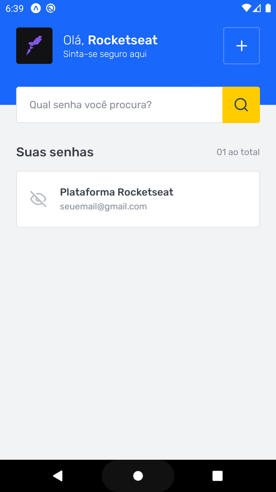
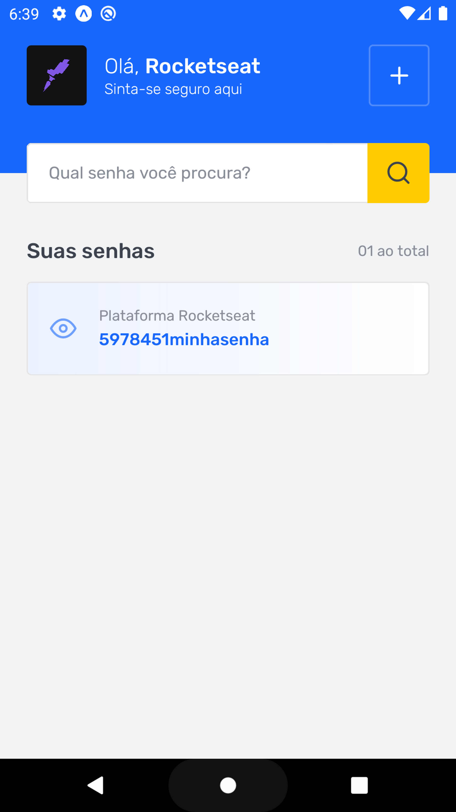
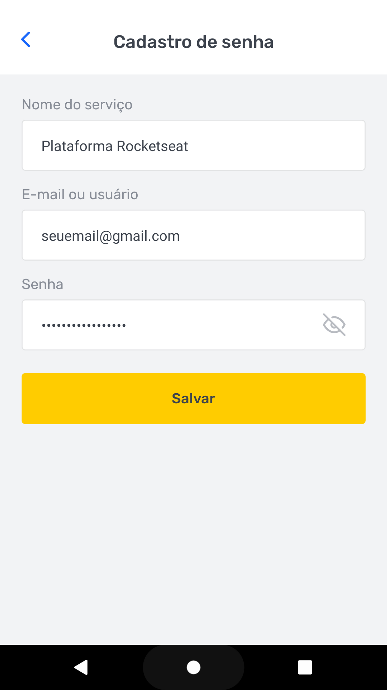

<h1 align="center">
  
</h1>

  
  
  
  
  
  

# Ignite_React-Native_Challenge_02

React Native challenge done with 'Rocketseat' Ignite course. ("Desafio 02 - SavePass")

## 💻 Sobre o desafio

Nesse desafio, você irá implementar uma aplicação de gerenciamento de senhas: SavePass.

Essa aplicação possui duas telas, sendo a primeira delas uma listagem das senhas salvas e a segunda a tela de cadastro de novos logins.

<h1 align="center">
     
     
     
</h1>
